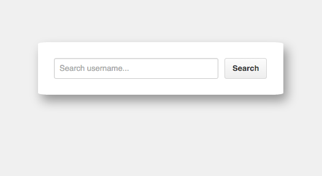
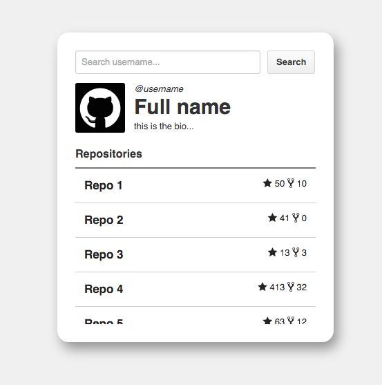
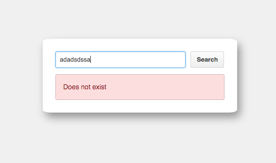

## Github Search


## Introduction

This a client side web application brings information about Github repositories. There is a searcher where you can introduce a Github username and it returns a repositories list with access links of the user, besides, some public data like the avatar, name or username.

## SCREENSHOTS

#### First Screen

The user can search a username of GitHub

<p align="center">
  
</p>

#### Success Screen

If the searched username does exist: The searched user profile is displayed with all his repositories

<p align="center">
  
</p>

#### Error Screen

If the searched username does not exist: An error is shown

<p align="center">
  
</p>

Your can run the deployed project here: [GitHub Search App](https://github-searching.herokuapp.com/)

## Technical Description

- This project has been developed with Javascript, CSS-SASS, and following BEM rules.
- Webpack as a bundler and Babel how transpiler.
- FETCH has been utilized for the API calls.
- API consumed: [GitHub API](https://docs.github.com/en/free-pro-team@latest/rest)
- Jasmine for testing.
- Git and github.

This project uses the GitHub API, you can find more information features in:

https://docs.github.com/en/free-pro-team@latest/rest/reference/users

https://docs.github.com/en/free-pro-team@latest/rest/reference/search#search-users

## Usage

**Prerequisites:**

- Install Node.js if you haven't yet (https://nodejs.org/es/). Npm is needed but is included installing Node.js.

**Next steps:**

- Clone or download the repository in your computer.

```bash
git clone https://github.com/gabogarciam/github-search.git`
```
- Install the dependencies in your own repository from the main folder.

```bash
npm install
```

**Running:**

- Compile and run the project in development version.
```bash
npm run dev

```

Open the project trought the links are provided by the server.

```
   │   Serving!                                        │
   │                                                   │
   │   - Local:            http://localhost:3000       │
   │   - On Your Network:  *********************       │
   │                                                   │
   │   Copied local address to clipboard!              │
```

## Instructions for testing

Open the file 'SpecRunner.html' in your browser.

## Test

The logic has been tested with Jasmine.

